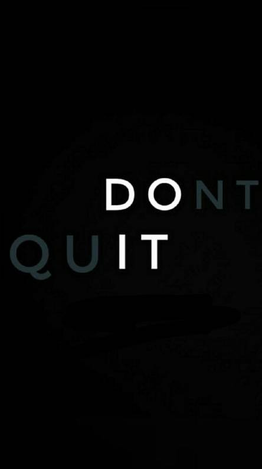

### Hi there👋 It’s a pleasure to meet you.
[][linkedin]
[][instagram]

##   👋 Wanna know more about me

- 🔭 I’m currently working on app development!
- 👯 I’m looking for internships and job opportunities.
- 🥅 Goals: Want to Learn Everyday.
- ⚡ Fun fact: I am super excited to learn new things.

### Connect with me:

[][github]
[][twitter]
[][linkedin]
[][instagram]

 
 

[twitter]: https://www.twitter.com/NehaNooka
[instagram]: https://www.instagram.com/nooka_neha
[linkedin]: https://www.linkedin.com/in/neha-nooka-076588153
[github]: https://github.com/NookaNeha
